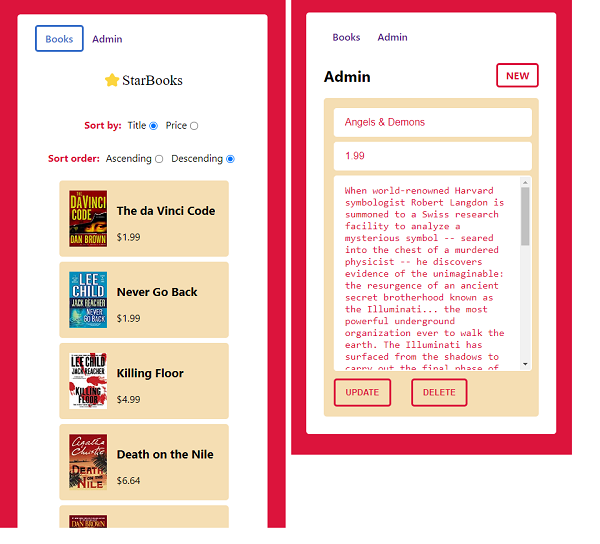

## __1. Add packages__
- ### `$ npm i axios express history react-router-dom styled-components`
- ### `$ npm i -D eslint eslint-plugin-react eslint-config-prettier prettier`

## __2. Data__
- ### `$ node server.js` and go to port `3001`

## __3. Add scripts to `package.json`__
```json
"lint": "eslint src/**/*.{js,jsx,ts,tsx,json}",
"format": "prettier --write src/**/*.{js,jsx,ts,tsx,css,md,json,scss} --config ./.prettierrc"
```

## __4. Add `.eslintrc.json`__
```json
{
    "env": {
        "browser": true,
        "node": true,
        "es2021": true
    },
    "extends": [
        "eslint:recommended",
        "plugin:react/recommended",
        "plugin:react/jsx-runtime",
        "prettier"
    ],
    "parserOptions": {
        "ecmaVersion": "latest",
        "sourceType": "module"
    },
    "settings": {"react": {"version": "detect"}},
    "plugins": [
        "react"
    ],
    "rules": {
        "react/prop-types": "off"
    }
}
```

## __5. Add `.prettierrc`__
```json
{
  "singleQuote": true,
  "trailingComma": "none",
  "tabWidth": 2,
  "semi": false,
  "jsxSingleQuote": true,
  "bracketSpacing": false,
  "bracketSameLine": false,
  "arrowParens": "avoid",
  "proseWrap": "always",
  "singleAttributePerLine": true,
  "printWidth": 120
}
```
